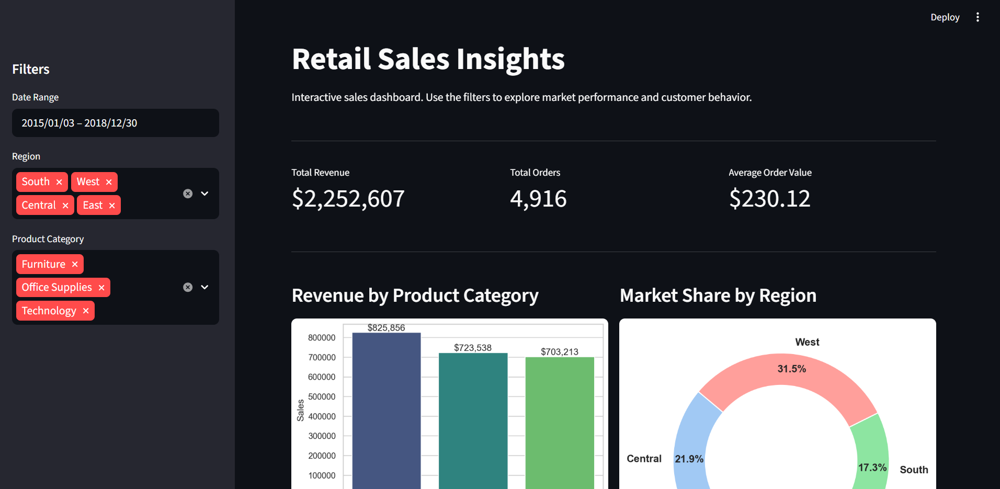

# 📊 Retail Sales Insight Dashboard

## 📝 Project Overview
This project is an end-to-end data analytics pipeline and interactive dashboard built to analyze historical sales data for a retail store. The objective is to uncover actionable business insights regarding product performance, seasonal sales trends, geographical market share, and customer segmentation. 

The project demonstrates a full data engineering and analytics workflow: 
1. **Extract & Load (ETL):** Ingesting raw CSV data into a relational database.
2. **Exploratory Data Analysis (EDA):** Cleaning data and discovering trends using Jupyter Notebooks.
3. **Data Visualization & UI:** Serving the insights through a dynamic, filterable web application.




---

## 🛠️ Tech Stack
* **Language:** Python 3.13.7
* **Database:** MySQL
* **Data Manipulation:** Pandas, NumPy
* **Data Visualization:** Matplotlib, Seaborn
* **Frontend/Dashboard:** Streamlit
* **Database Connectivity:** SQLAlchemy, PyMySQL
* **Environment Management:** python-dotenv

---

## 📂 Project Architecture
```text
Retail-Sales-Dashboard/
│
├── data/                   # Raw data files
│   └── train.csv           # Original Kaggle dataset
│
├── notebooks/              # Jupyter notebooks for EDA
│   └── data_cleaning.ipynb 
│
├── scripts/                # Standalone Python modules
│   ├── __init__.py
│   ├── import_data.py      # ETL script to push CSV data to MySQL
│   └── data_service.py     # Database connection & Pandas cleaning logic
│
├── app.py                  # Main Streamlit dashboard application
├── .gitignore              # Hides environment variables and system cache
└── README.md               # Project documentation
